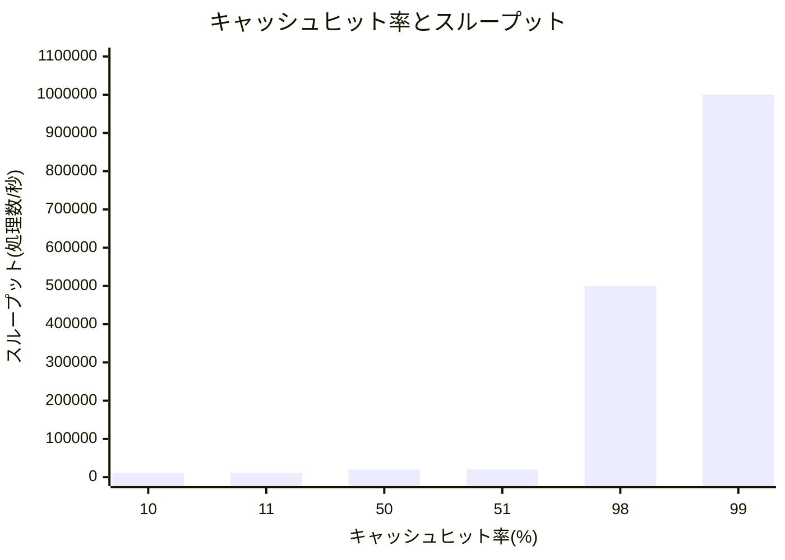

「詳解 システム・パフォーマンス」 の 「2.3.14　キャッシング」 の節に、

> ヒット率が98%のときと99%のときのパフォーマンスの差は、ヒット率が10%のときと11%のときのパフォーマンスの差よりもずっと大きい。キャッシュヒットのときとキャッシュミスのときのスピードの差、つまり関わっているふたつのストレージティアのスピードの差のために、非線形のプロファイルになる。

という記述がある。

https://www.oreilly.co.jp/books/9784814400072/

以下のような図も載せられており、この図を見ると確かにヒット率が高いほど 1% による違いが出そうである。


ただ、あまり感覚的に掴めていなかったので実験してみた。

## 実験コード

```go
package main

import (
	"fmt"
	"time"
)

func main() {
	// キャッシュのエントリ数を設定
	cacheCount := 99
	cache := make(map[int]bool, cacheCount)

	// キャッシュを初期化
	for i := 0; i < cacheCount; i++ {
		cache[i] = true
	}

	hits := 0
	misses := 0

	// 計測開始
	start := time.Now()

	for i := 0; i < 100; i++ {
		for j := 0; j < 100; j++ {
			if _, isHit := cache[j]; isHit {
				hits++
			} else {
				misses++
				time.Sleep(100 * time.Microsecond) // キャッシュミス時の遅延をシミュレート
			}
		}
	}

	// 処理終了時間を計算
	duration := time.Since(start)

	// 結果を表示
	fmt.Printf("キャッシュヒット率: %.2f%%\n", float64(hits)/float64(hits+misses)*100)
	fmt.Printf("スループット: %.f 処理数/秒\n", float64(10000)/duration.Seconds())
}
```

[Go Playground](https://go.dev/play/p/zL3BXBRtHMs)

- 0 から cacheCount - 1 までの数をキャッシュ
- キャッシュに存在しない場合はディスクなどへのアクセスをシミュレートするために 100μs sleep
- 0〜99 に対するキャッシュヒット処理をそれぞれ 100回実施
  - 合計 10,000回の処理

## 結果

`cacheCount` を変えつつ試した結果は以下のようになった。

| キャッシュヒット率(%) | スループット(処理数/秒) |
|---|---|
| 10 | 11111 |
| 11 | 11236 |
| 50 | 20000 |
| 51 | 20408 |
| 98 | 500000 |
| 99 | 1000000 |

棒グラフにするとより分かりやすい。



結果を見ながら思ったのだが、

- 100回中、99回ヒット
- 100回中、98回ヒット

と書くと、いまいちその違いが掴めないが、

- 100回のうち1回だけ10秒待つ
  - 99%のキャッシュヒット率
- 50回のうち1回だけ10秒待つ
  - 98%のキャッシュヒット率

と書くと、前者では100回の処理が10秒ちょっとで終わるのに対して、後者では20秒ちょっとかかることが分かり、秒あたりの処理数に2倍近くの違いが出るのが分かる[^1]。

この辺は日々パフォーマンスを見ている人だったら、わざわざ表現を変えずとも感覚的に掴めるんだろうけど、なかなか面白かった。

> [!NOTE]
> 「スループットの変化はキャッシュヒット率ではなくキャッシュミス率で捉えた方が直感的」という趣旨のコメントをいくつかいただきました。
> たしかに、ミス率が 1% → 2% → 4% となるにつれ、処理にかかる時間が倍々になる(スループットが半減する)というのは分かりやすいですね。

## 追記: ストレージティア間のスピードが近かったらどうなるか

この記事の始めに引用したように、非線形のプロファイルになるのは「関わっているふたつのストレージティアのスピードの差」によるものだが、ではそれらのスピードが近かったらどうなるのだろうか。
(元のコードだと、メモリ&キャッシュラインが活用されているので 100μs sleep との差は激しい状態)

そこでストレージティアのスピードの比率が 1:1000, 1:100, 1:10 の状況と同じようになるようにコードを変えつつ試してみた。

```diff
	for i := 0; i < 100; i++ {
		for j := 0; j < 100; j++ {
			if _, isHit := cache[j]; isHit {
				hits++
+				// キャッシュヒットした場合も sleep する(これは 1:100 のティア比のコード)
+				time.Sleep(1 * time.Microsecond)
			} else {
				misses++
				time.Sleep(100 * time.Microsecond) // キャッシュミス時の遅延をシミュレート
			}
		}
	}
```

| キャッシュヒット率(%) | 1:1000のティア比 | 1:100のティア比 | 1:10のティア比 |
|---|---|---|---|
| 10 | 11110 | 11099 | 10989 |
| 11 | 11235 | 11222 | 11099 |
| 50 | 19980 | 19802 | 18182 |
| 51 | 20387 | 20198 | 18484 |
| 98 | 476644 | 335570 | 84746 |
| 99 | 909918 | 502513 | 91743 |


ストレージティアのスピードの差が小さくなるにつれて、98% → 99% でのスループット改善も小さくなるのが分かる。
また、ヒット率が 50% 程度の時はティア比が違ってもスループットはあまり変わらない。
逆に言うとヒット率が 50% 程度しか出せない場合は、1:10 のティア比のストレージを選択しても良いわけで、この辺はコスパの判断に使えそう。

## 追記2: 実環境におけるキャッシュヒット率

> [!NOTE]
> [wataberyota さんのコメント](https://zenn.dev/link/comments/899333f062fa2e)を元に追記しました。ご指摘ありがとうございます。

実環境では、「キャッシュヒット率がどのようなワークロードによって構成されているか」を把握することが重要。

たとえば、Webサービスのデータベースにおいては以下のような状況が考えられる。

- 日中のアクセスでは、少量のデータの読み書きが大半を占める
- 夜間のバッチ処理では、日中アクセスしたものとは異なる大量のデータの読み書きが行われる

この場合、日中の処理では比較的高いキャッシュヒット率が得られる一方で、夜間のバッチ処理ではヒット率が低くなり、全体で計測されるキャッシュヒット率はこれら異なるワークロードの影響を反映したものとなる。

こうした特性から、ワークロードを変えずにキャッシュヒット率の向上を目指すことが現実的に困難である場合もある。また、無理に向上させようとすると、過剰なリソース確保につながる可能性も。

加えて、キャッシュ自体にも多様な種類が存在する。
(例に挙げたデータベース関連でも目的の異なる複数のキャッシュがある)

他にも CPU、ディスク、ネットワークなどを代表にさまざまなレイヤーでキャッシュが活用されており、それぞれのキャッシュには異なる目安のヒット率やチューニング方法があって、とても奥深い…。

[^1]: キャッシュヒットした場合でも処理時間は0ではないので「ちょっと」と書いた
